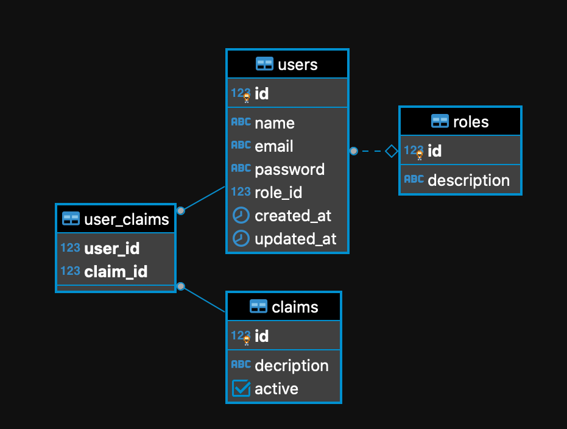

# Teste

### O que deve ser feito

Utilizando a mesma estrutura do banco de dados fornecida anteriormente, e a linguagem que desejar, construa uma API REST que irá listar o papel de um usuário pelo “Id” (role_id).

Utilizando a mesma estrutura do banco de dados fornecida anteriormente, e a linguagem que desejar, construa uma API REST que irá criar um usuário. Os campos obrigatórios serão nome, e-mail e papel do usuário. A senha será um campo opcional, caso o usuário não informe uma senha o serviço da API deverá gerar essa senha automaticamente.

Crie uma documentação que explique como executar seu projeto em ambiente local e também como deverá ser realizado o ‘deploy’ em ambiente produtivo.
